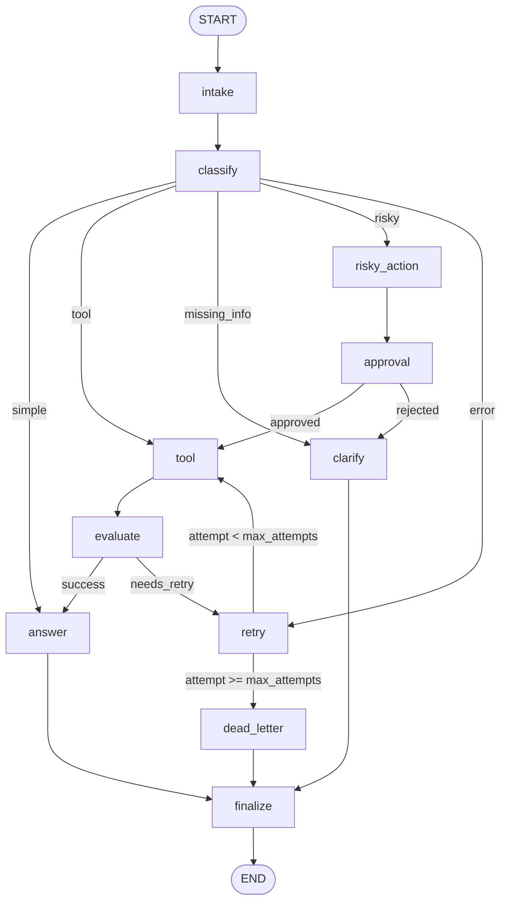

# Day 08 Lab Report

## 1. Team / student

- Name: Bui Van Dat
- Repo/commit: https://github.com/buivandat275/phase2-track3-2A202600355-BuiVanDat
- Date: 11/05/2026

## 2. Architecture

The workflow is a LangGraph `StateGraph` with explicit node boundaries:

- `intake`: normalizes the query and starts the audit trail.
- `classify`: chooses `simple`, `tool`, `missing_info`, `risky`, or `error` using keyword policy.
- `tool` and `evaluate`: simulate tool execution and validate whether the result is usable.
- `retry`: increments attempt count and loops back to `tool` while retry budget remains.
- `risky_action` and `approval`: model human-in-the-loop approval before risky work.
- `clarify`, `answer`, `dead_letter`, and `finalize`: terminate every path safely.

Graph diagram extension was exported to `reports/graph_diagram.mmd`:

## 3. State schema

| Field | Reducer | Why |
|---|---|---|
| `thread_id` | overwrite | stable checkpoint key per scenario run |
| `scenario_id` | overwrite | links final metrics to the scenario |
| `query` | overwrite | normalized user input |
| `route` | overwrite | current route decision |
| `risk_level` | overwrite | latest risk classification |
| `attempt` | overwrite | retry counter must reflect current attempt |
| `max_attempts` | overwrite | scenario-specific retry budget |
| `final_answer` | overwrite | final user-facing response |
| `pending_question` | overwrite | clarification prompt when information is missing |
| `proposed_action` | overwrite | action submitted for approval |
| `approval` | overwrite | latest reviewer/HITL decision |
| `evaluation_result` | overwrite | retry gate value: `success` or `needs_retry` |
| `messages` | append | conversation/audit snippets |
| `tool_results` | append | preserves every tool attempt result |
| `errors` | append | preserves retry and dead-letter evidence |
| `events` | append | node-by-node audit trail for metrics |

## 4. Scenario results

- Total scenarios: 13
- Success rate: 100.00%
- Average nodes visited: 6.69
- Total retries: 5
- Total interrupts/approval events: 4
- Resume success: False

| Scenario | Expected route | Actual route | Success | Retries | Interrupts |
|---|---|---|---:|---:|---:|
| S01_simple | simple | simple | True | 0 | 0 |
| S02_tool | tool | tool | True | 0 | 0 |
| S03_missing | missing_info | missing_info | True | 0 | 0 |
| S04_risky | risky | risky | True | 0 | 1 |
| S05_error | error | error | True | 2 | 0 |
| S06_delete | risky | risky | True | 0 | 1 |
| S07_dead_letter | error | error | True | 1 | 0 |
| S08_cancel | risky | risky | True | 0 | 1 |
| S09_track_order | tool | tool | True | 0 | 0 |
| S10_vague_issue | missing_info | missing_info | True | 0 | 0 |
| S11_crash | error | error | True | 2 | 0 |
| S12_revoke | risky | risky | True | 0 | 1 |
| S13_find_ticket | tool | tool | True | 0 | 0 |

## 5. Failure analysis

1. Retry or tool failure: error-route scenarios intentionally produce `ERROR` tool results on early
   attempts. `evaluate` sets `evaluation_result=needs_retry`, `retry` increments `attempt`, and
   `route_after_retry` either loops to `tool` or sends the run to `dead_letter`.
2. Risky action without approval: risky keywords such as refund/delete/send route to
   `risky_action` first. The graph cannot reach `tool` from that path until `approval` returns an
   approved decision; rejected approval terminates through clarification.

## 6. Persistence / recovery evidence

The graph is compiled with a checkpointer from `build_checkpointer`. The default config uses
`MemorySaver`, and every scenario invokes the graph with a stable `thread_id` such as
`thread-S05_error`. SQLite support is implemented in `persistence.py` for a persistence demo by
setting `checkpointer: sqlite` in `configs/lab.yaml` and installing the optional sqlite extra.

## 7. Extension work

Completed extension: graph diagram export. The generated Mermaid diagram is written to
`reports/graph_diagram.mmd` and embedded above so the control flow can be inspected during the demo.

## 8. Improvement plan

With one more day, I would productionize structured tool results first: replace string markers with
typed result objects, add idempotency keys for retry-safe tool calls, and add a real reviewer UI for
approval interrupt/resume.
